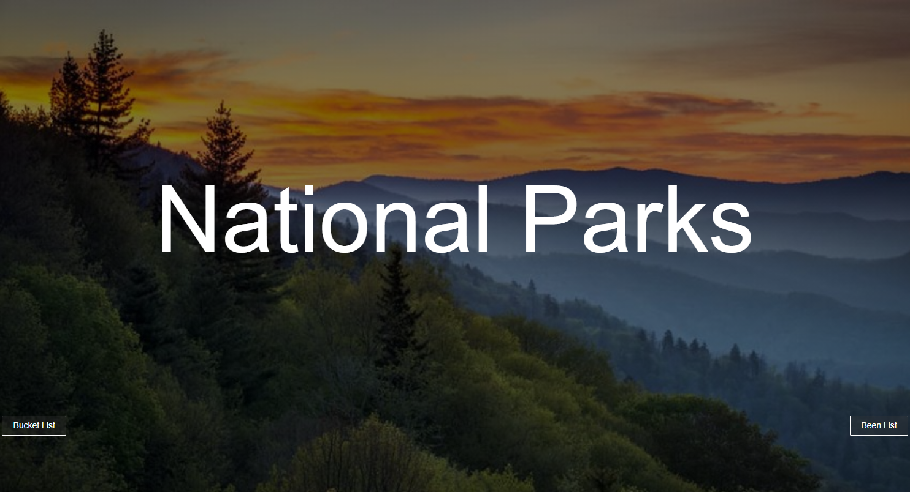
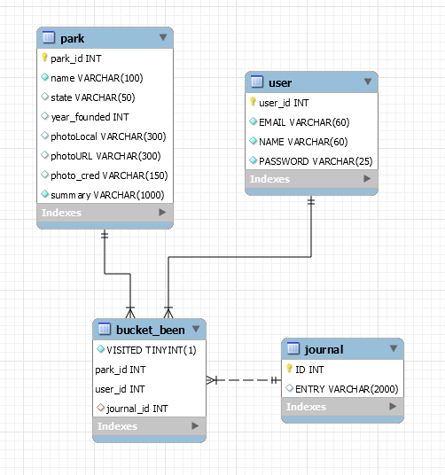
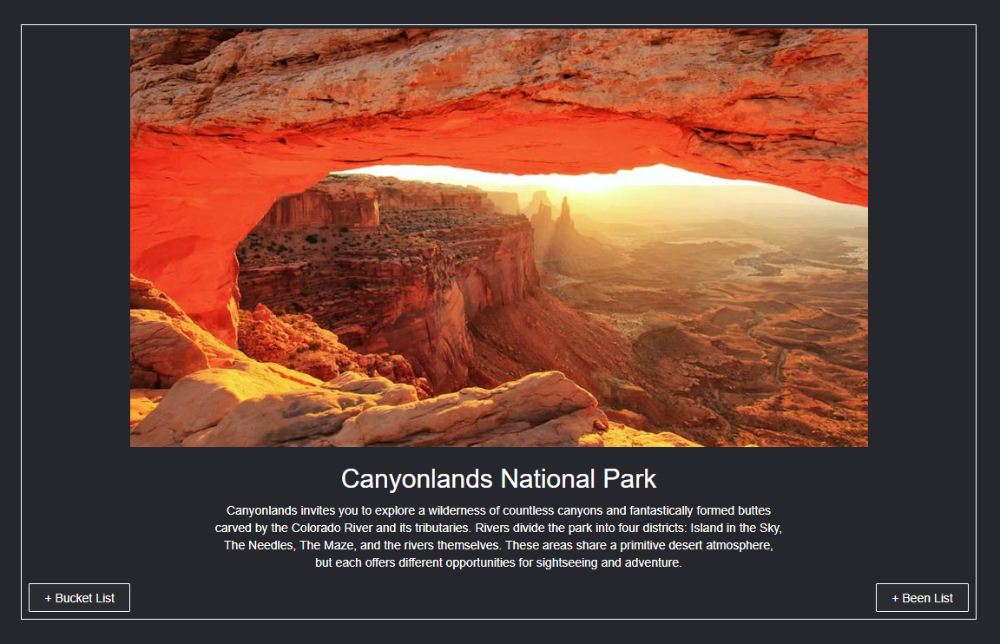

# National Parks Bucket/Been List App

Repository: https://github.com/LindseyM20/National_Parks

## Table of Contents
  * [**Description**](#description)
  * [**User Stories**](#user-stories)
  * [**Technologies**](#technologies)
  * [**Installation and Usage**](#installation-and-usage)
  * [**Obstacles and Solutions**](#obstacles-and-solutions)
  * [**Tests**](#tests)
  * [**Sources**](#sources)
  * [**License**](#license)
  * [**Questions**](#questions)

## Description
This is an app with which a person can view beautiful photos and descriptions of all the U.S. National Parks, save parks to their own personal bucket list, add parks to their been list, and write, edit, and delete journal entries on any park in their bucket or been list. Inspiration for this application came from my own curiosity about the National Parks and my desire to keep track of bucket list parks, then check them off when visited and see where I've been.

## User Stories
* As a traveler, I want an application to view National Parks so that I can plan trips.
* As a traveler, I want an application to save a bucket list of parks so that I can keep track of my top priority destinations. 
* As a traveler, I want an application to save a been list of parks so that I can keep track of the parks I've already visited.
* As a traveler who likes to plan, I want a way to write, edit, and delete information about each of my bucket list parks so that I can save and keep track of travel tips.
* As a traveler who has visited National Parks, I want a way to write, edit, and delete information about the parks I've visited so that I can have journal mementos.

## Technologies
A dynamic Spring MVC web app built with Maven, this program utilizes JPA complete with entities as models, DAO classes and interfaces, and service classes to perform CRUD operations on the MySQL database. JUnit tests are implemented to assure accuracy of DAO methods. Java annotations are used rather than XML where possible. Currently, Tomcat server is used to run the application locally on port 8080.

## Installation and Usage
Fork this project from the repository into Eclipse or your Java editor. Then, find the SQL scripts in WebContent -> resources -> sql_scripts and open in your MySQL Workbench or HeidiSQL. Follow the instructions in the sql file to create the database, create the park table, and fill the park table. Adjust the persistence.xml to match your database program's user and password, then run the project on the server.

## Obstacles and Solutions
* My first big challenge was wiring up the JPA entities so that the program would create tables with relationship mappings the way I intended. This issue took some instructor help, a lot of Google help, and ultimately, just trying things many times, many different ways.
* Working with the controller also proved to be a challenge, making things tricky when I wanted to dynamically append HTML elements to a page or render elements if a condition is met, for instance. Connecting the JPA views with Controller methods was new for me and different from what I'm used to with Javascript, but it took a lot of trial and error and Google. (And I'm sure there's still room for improvement!)
* The last obstacle I faced in the development of this application was the timeline and sheer amount of time everything takes. I would have liked to implement so many more ideas, including deploying on the web - but I had to stick to the basic functionality and keep on track with my MVP goals first. Keeping a prioritized list of To-Dos helped with that.

## Tests
JUnit tests were made and performed, and all unit tests pass. Find them in the tests package.

## Sources
The National Park photographs used in this project are from https://www.thediscoverer.com/blog/every-us-national-park-ranked - with the exception of a couple which are from nps.gov. 

The description of each park is also from the nps.gov website.

## License
The contents of this repository are protected under the MIT License

## Questions
Follow me on GitHub at https://github.com/LindseyM20  
Please contact me with any questions or feedback at lindsey.bordner@gmail.com 
